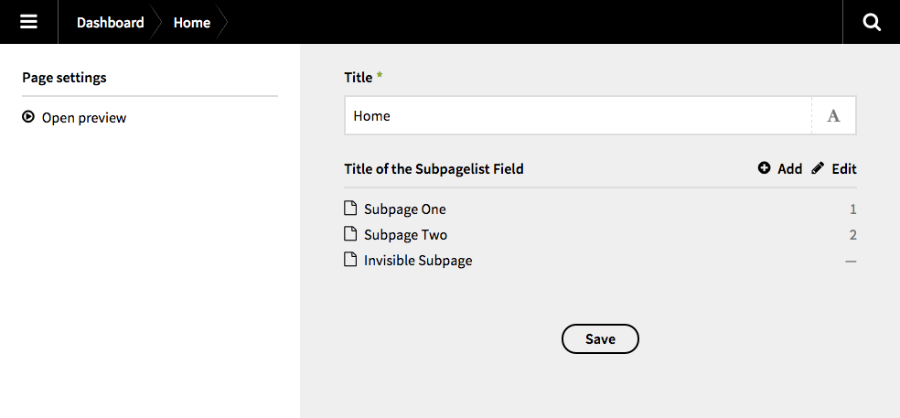

# Kirby Subpagelist


With this field plugin for [Kirby 2](http://getkirby.com) you can display the list of subpages in the main column of the panel. Simply add the new field „subpagelist” to your blueprints.

### Please notice

With this plugin I basically wanted to level up my Kirby skills (learning by doing). It is inspired by [this topic](http://forum.getkirby.com/t/showing-only-subpages/227) by [thguenther](http://forum.getkirby.com/users/thguenther/activity). If you have any tipps or suggestions, please contact me.

## Requirements


**You need Kirby 2.2.1 or newer to use this version of the plugin.**  
For older versions of Kirby 2, please check out the [legacy](https://github.com/flokosiol/kirby-subpagelist/tree/legacy) branch!


## Preview





## Installation

### Copy & Paste

Add (if necessary) a new `fields` folder to your `site` directory. Then copy the whole content of this repository in a new folder called `subpagelist`. Your directory structure should now look like this:

```
site/
	fields/
		subpagelist/
			assets/
			subpagelist.php
			template.php
```

### Git Submodule

It is possible to add this plugin as a Git submodule.

```bash
$ cd your/project/root  
$ git submodule add https://github.com/flokosiol/kirby-subpagelist.git site/fields/subpagelist
```

For more information, have a look at [Working with Git](http://getkirby.com/blog/working-with-git) in the Kirby blog.


## Usage

Now you are ready to use the new field `subpagelist` in your blueprints. 

```
...
fields:
	mysubpagelist:
		label: My Subpagelist
		type:  subpagelist
...
```


### Optional settings

There are some optional parameter, which change the display of the subpagelist

+ `flip` – returns the subpages in reverse order 

The parameter `filter` needs some more configuration:

+ `visible`– returns only visible pages if set to `TRUE` and only invisible ones if set to `FALSE`
+ `template`– filters by (one or more) [used templates](http://getkirby.com/docs/cheatsheet/page/template) 
+ `intendedTemplate` filters by (one or more) [intended templates](http://getkirby.com/docs/cheatsheet/page/intended-template)
+ `filterBy`, `filterMethod` and `filterValue` make use of the [filterBy](http://getkirby.com/docs/cheatsheet/pages/filterBy) method for pages ([Example](https://github.com/flokosiol/kirby-subpagelist/issues/7#issuecomment-229727047))


### Example

```
...
fields:
	mysubpagelist:
		label: My Subpagelist
		type:  subpagelist
		
		flip:  true
		filter:
			visible: true
			template: mytemplate						
...
```

### Optional pages settings

The following parameter will be inherited from the `pages` settings.

+ `limit` – adds pagination after x items

```
...
pages:  
  limit: 32  
...
```

To hide the subpages in the sidebar, simply add this to your blueprint (as described in the [Kirby docs](http://getkirby.com/docs/panel/blueprints/page-settings#hide-subpages)):

```
...
pages:  
  hide: true  
...
```