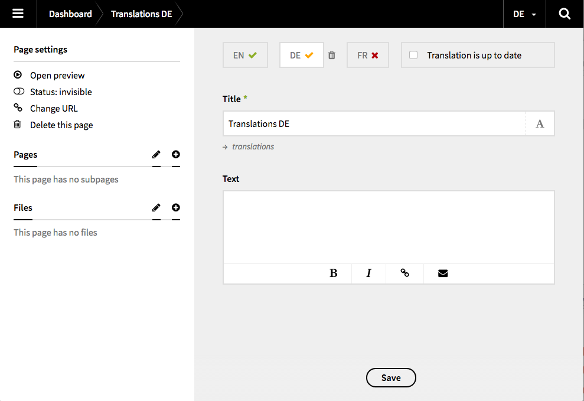

# Kirby Translations

 

This plugin enhaces the translation handling for [Kirby 2](http://getkirby.com) with the following features:

+ possibility to delete translations
+ possibility to resynchronize translations with the default language file
+ handle and display the translation status for pages in the panel

## Please notice

There's a [known issue](https://github.com/getkirby/panel/issues/910), where the state of a checkbox isn't displayed properly. There might be a fix for [Kirby 2.4](https://github.com/getkirby/panel/milestone/6).

Since **version 0.3** Kirby Translations comes as **plugin**, not as a field. Keep that in mind if you are updating from a previous version.


## Preview



## How it works

The plugin automatically detects if there's a language `.txt` file and displays an icon within the language tabs. By using checkbox you can manually define whether the translation for this page is up to date or not. This ends up in a **green** or **orange** checkmark. To sum it up, there are three possible states: 

+ **RED**: The translated `.txt`-file does not exist
+ **YELLOW**: The translated `.txt`-file exists, but the content is not up to date (checkbox unchecked)
+ **GREEN**: The translated `.txt`-file exists and the content is up to date (checkbox checked)

Furthermore you can delete a translation without deleting the whole page.


## Installation

### Kirby CLI

If you are using the [Kirby CLI](https://github.com/getkirby/cli) you can install this field plugin by running the following command in your shell from the root folder of your Kirby installation:

```
kirby plugin:install flokosiol/kirby-translations
```

### Copy & Paste

Add (if necessary) a new `plugins` folder to your `site` directory. Then copy the whole content of this repository in a new folder called `translations`. Your directory structure should now look like this:

```
site/
  plugins/
    translations/
      ...
```

### Git Submodule

It is possible to add this plugin as a Git submodule.

```
$ cd your/project/root  
$ git submodule add https://github.com/flokosiol/kirby-translations site/plugins/translations
```

For more information, have a look at [Working with Git](https://getkirby.com/docs/cookbook/working-with-git) in the Kirby cookbook.


## Usage

Now you are ready to use the new field `translations` in your blueprints. 

```
...
fields:
  mytranslations:
    type: translations
...
```

### Optional settings

If you like, you can disable the checkbox (and with it the orange status) and/or the possibility to delete or update translations with the following setup.

```
...
fields:
  mytranslations:
    type: translations
    deletable: false
    updatable: false
    uptodate: false
...
```
## Roadmap and ideas

- [ ] add filtering example to README
- [ ] add translations for text
- [ ] add widget with translations overview
- [ ] add widget with list of untranslated pages
- [x] ~~option to activate/deactivate up to date checkbox~~
- [x] ~~option to activate/deactivate delete functionality~~